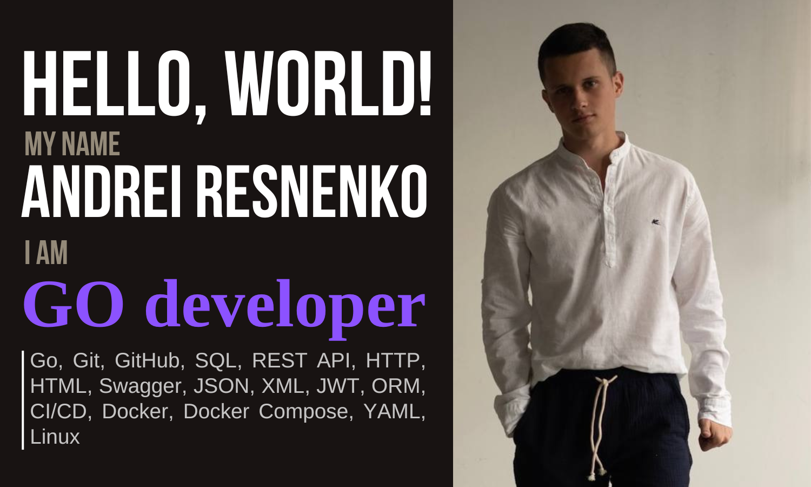

## Мои навыки 

Ещё подробности

Я начинающий разработчик, который освоил эти технологии в рамках курса "Go разработчик" на Яндекс.Практикуме. Активно развиваю навыки в DevOps и интеграции нейросетей!

## Цитата для вдохновения

Все проблемы - иллюзии ума.

Экхарт великий

Обновляется каждый час!